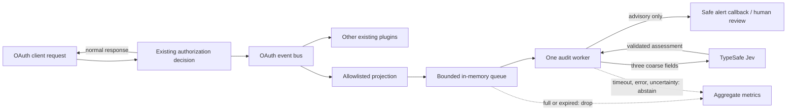
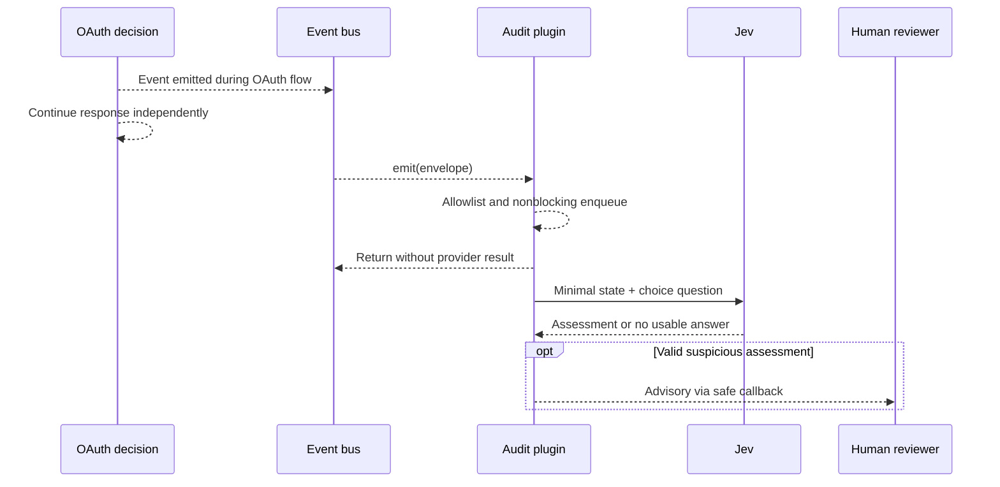

# How shadow monitoring works

Your OAuth service remains the source of access decisions. The event bus can fan out an event to this plugin, which creates a *new*, tiny projection and queues it for one asynchronous worker. Jev sees that projection, not the original envelope. A valid “suspicious” assessment can call your alert sink; it never feeds back into the OAuth decision.

**There is no arrow from Jev or the alert sink back to the decision.** Independent event-bus plugins may have their own logging and privacy behavior; review them separately.

## One event's journey

1. `emit(envelope)` checks a finite allowlist of 13 OAuth event kinds and six canonical IAM outcome kinds plus the `info`, `warning`, or `error` severity. IAM producer mapping is not yet integrated. Unknown values are skipped.
2. `project_event` constructs `{event_kind, severity, outcome}`. The `outcome` is a heuristic from the *kind* (`failure`, `success`, or `observed`), not an observed access verdict. A revoked or expired token event, for example, is merely `observed`. It never serializes and then redacts an envelope.
3. If enabled, the plugin attempts an immediate enqueue. The queue defaults to 64 entries; a full queue drops the event. One worker discards items older than the default 2-second queue TTL.
4. The worker sends a choice question (`suspicious`, `routine`, `other`) to the provider with a default 1-second request timeout, no retries, and a 16 KiB response limit. HTTP redirects and proxies are disabled. The blocking HTTP call uses one dedicated thread; a timed-out underlying socket may continue until its own timeout.
5. Only a strictly validated Jev-family `suspicious` response with provider-reported usage above the configured confidence threshold (default 0.8) triggers the safe alert callback. `routine` records an aggregate result; `other`, malformed/low-confidence responses, transport errors, and timeouts do not alert. A non-Jev model identifier abstains.

**Delivery is at-most-once and in-memory.** Restarts, queue pressure, expiry, shutdown, or upstream bus behavior can lose observations. This is intentional for shadow mode, not a reliable audit ledger. See [alerts and limits](alerts.md) and [latency measurement](measurement.md).
