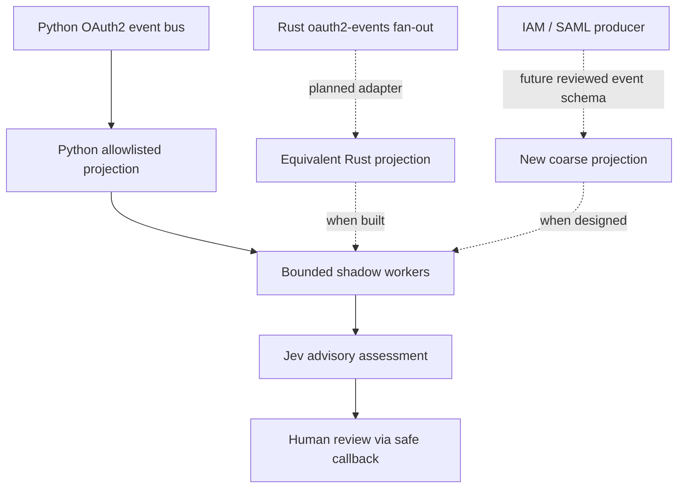

# Integration roadmap

This repository provides a Python `AuditPlugin`, not an installed hook in any OAuth server. The roadmap below separates what exists from what would need to be built and reviewed. None of these steps should put Jev on the authorization path.

## Python OAuth2 event bus

1. Identify the server's actual `EventEnvelope` and event enum definitions and its `EventBus(plugins=[...])` lifecycle. Confirm when and where events are emitted. Do not assume the bus is off-path merely because the plugin uses a queue.
2. Use the plugin as an additional fan-out consumer; start it on app startup, register it with the bus, and call `close()` at shutdown. `emit()` constructs a projection and attempts `put_nowait`; never `join()` inside a request handler.
3. Compare the concrete producer enum literals and severity values to the plugin allowlist. Unknowns are intentionally skipped; do not expand the allowlist without privacy review and tests.
4. Supply a fast callback for **safe advisory fields only**. Observe disabled/skipped/queue-full/expired/abstain rates and isolate callback failures. Run fake-transport tests before an opt-in provider test using non-customer synthetic events.
5. Confirm via tracing and request-path measurements that audit failures cannot delay or alter access decisions; review other event-bus plugins' logging separately.

## Rust `oauth2-events` producer

A Rust `EventEnvelope` has analogous event kind and severity along with private IDs, metadata, and tracing context. Do **not** serialize the whole envelope into Python or forward trace context to Jev. A future Rust adapter should construct the same finite enum-only projection at the event fan-out boundary, use its own bounded asynchronous worker that drops observations rather than blocking OAuth, and compare outbound payloads against Python contract tests. Document overload, timeout, shutdown, and callback behavior before use. This adapter is **not implemented** in this repo.

## IAM and SAML extension

First define a producer-specific, finite schema of coarse authentication outcome enums; keep assertions, attributes, NameID, session identifiers, credentials, and other identifiers out of the provider payload. For IAM, identify the actual source events and permissions before defining semantics. For SAML, distinguish protocol failure from an access denial rather than interpreting either from a generic event name. Review privacy, tenancy boundaries, event volumes, and test contracts with synthetic data. Build separate adapters and load/latency tests rather than claiming the current OAuth-only plugin supports these sources.

Any future automated access action is a **different product boundary**, requiring explicit policy ownership, calibrated evidence, false-positive analysis, and a safe rollout. [Privacy controls](privacy.md) and [measurement criteria](measurement.md) apply before expanding the lookout's view.
