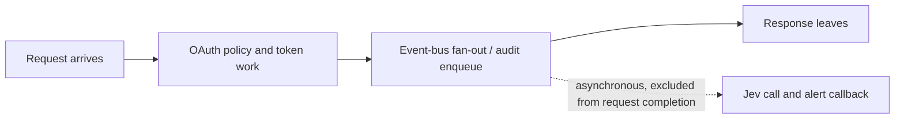

# Measuring decision latency

**There is no measured production request-path latency or decision-quality result for this MVP.** `Metrics.snapshot()` exposes provider-call duration sum/max and aggregate counters; those numbers describe the shadow worker, not the latency an OAuth client experiences. A fast worker is not evidence that a live request is unaffected.

## Define the measurement boundary

The **decision latency** is measured from request arrival to the final allow/deny or token decision, with a separately reported end-to-end response time. If event fan-out occurs before the response, its projection and enqueue cost **is** on the path and must be measured; the provider call should not be. If a real producer waits for plugins, verify that behavior rather than relying on the diagram. Report the exact start/end instrumentation points and architecture version.

## A defensible evaluation

1. Establish a baseline with the plugin absent or disabled. Repeat with it enabled under equivalent traffic. Record hardware, process count, load shape, event mix, queue settings, and whether provider calls are synthetic or real.
2. Instrument request-path decision and response distributions (including p50, p95, p99 and worst observed), plus plugin `emit()` enqueue duration. Use monotonic timing and a representative sample; report sample sizes and uncertainty, not only averages.
3. Run steady state, bursts, slow/failed provider, queue saturation, worker shutdown, and absent-key scenarios. Confirm access decisions and response behavior are unchanged, even when observations are dropped. Separate provider-call durations from request metrics.
4. Compare enabled-minus-baseline latency with an **agreed service-specific budget**. Report absolute distributions, tail deltas, confidence/variation, and dropped/expired/timeout/abstain rates. Do not set a universal safe threshold from this prototype.
5. Independently evaluate alert quality on a privacy-approved, labeled dataset with a defined ground truth and human review: precision, recall, false-positive/negative counts, class balance, and model/version drift. An offline fake transport checks behavior, not detection accuracy.

Until these studies and an integration review exist, claim only that the design intends to decouple provider calls from access decisions, **not** that any latency or detection target has been achieved. Automated authorization enforcement is out of scope.
